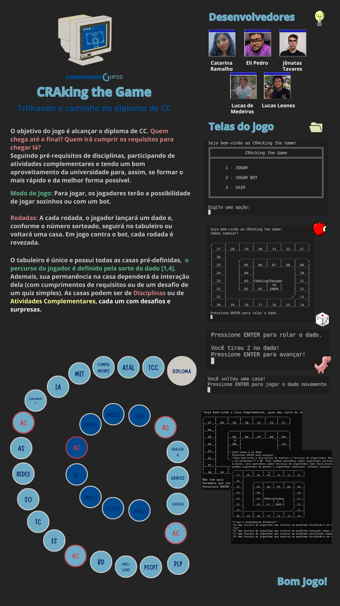

# 🎮 CRAking The Game

<p align="justify">
  Jogo desenvolvido em Haskell para aplicar conceitos aprendidos ao longo da disciplina de Paradigmas de Linguagem de Programação, ministrada pelo Prof. Dr. Everton Leandro Galdino Alves, no Curso Ciência da Computação, do UFCG - Campus Campina Grande, em 2023. O jogo consiste em trilhar as disciplinas obrigatórias de CC para caminhar pelo tabuleiro, passando pelos requistos do caminho.
</p>

## 🚀 Iniciando
1. É necessário ter uma versão de [Haskell](https://www.haskell.org/ghcup/ "Página inicial de Haskell") instalada em sua máquina

2. Baixe o repositório
 - Usando Git
  ```
  git clone https://github.com/lucasmedss/CRAckingTheGame.git
  ```
  - Usando GitHub CLI
  ```
  gh repo clone lucasmedss/CRAckingTheGame
  ```
  > 💡 ou da maneira que você preferir

3. Execute o arquivo 
  - Abra o prompt de comando de sua máquina
  - Acesse o diretório onde o arquivo está e entre em "Funcional"
  - Inicie a execução com o comando 
  ```
  cabal run
  ```
  > 💡 ou da maneira que você preferir

## ⚡ Como Jogar


## 💻 Equipe
<table>
  <tr align="center">
    <td><a href="https://github.com/catarinaramalho" title="Catarina Ramalho"><br /><sub>Catarina Ramalho</sub></a></td>
    <td><a href="https://github.com/elipcs" title="Eli Pedro"><br /><sub>Eli Pedro</sub></a></td>
    <td><a href="https://github.com/JonatasTavaresS" title="Jônatas Tavares"><br /><sub>Jônatas Tavares</sub></a></td>
    <td><a href="https://github.com/lucasmedss" title="Lucas de Medeiros"><br /><sub>Lucas de Medeiros</sub></a></td>
    <td><a href="https://github.com/lleones" title="Lucas Leones"><br /><sub>Lucas Leones</sub></a></td>
  </tr>
</table>
